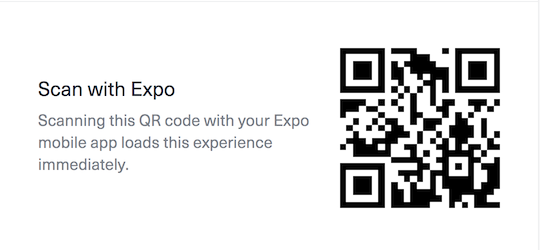

RUN:

Download Expo and view this project from here:
[https://expo.io/@tgdevjs/tgshop](https://expo.io/@tgdevjs/tgshop)\
Scaning the QR code or Typing exp://exp.host/@tgdevjs/tgshop inside of Expo will
open this experience. 

BUILD: This project was bootstrapped with
[Create React Native App](https://github.com/react-community/create-react-native-app).
Below you'll find information about performing common tasks.\
The most recent version of this guide is available [here](https://github.com/react-community/create-react-native-app/blob/master/react-native-scripts/template/README.md).

