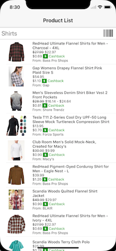
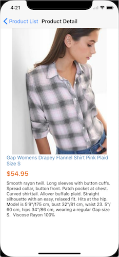

A React Native app for iOS that uses [shop.com api](http://developer.shop.com/)
to:

1. Search Term: http://api.shop.com/sites/v1/search/Term
2. Search Product: http://api.shop.com/stores/v1/products

RUN:

Download Expo here: https://expo.io/

Open project inside of expo app with this link:
[exp://rp-qn7.tgdevjs.tgshop.exp.direct:80](exp://rp-qn7.tgdevjs.tgshop.exp.direct:80)\
Or scan QR code inside expo app:

BUILD:

* Must provide API_KEY inside app/config/saga.js

* This project was bootstrapped with
  [Create React Native App](https://github.com/react-community/create-react-native-app).
  Below you'll find information about performing common tasks.\
  The most recent version of this guide is available [here](https://github.com/react-community/create-react-native-app/blob/master/react-native-scripts/template/README.md).

Features:

* Shop.com API for Search and Product
* Search with Barcode Scanner
* Redux
* Redux Saga
* React Navigation
* Extended Style Sheets

Limitations:

* very basic
* no network status
* no loading status
* no hardware features
